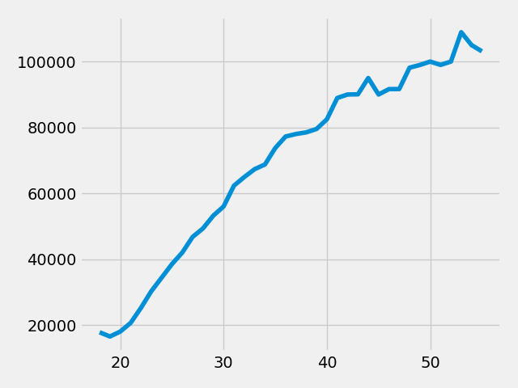
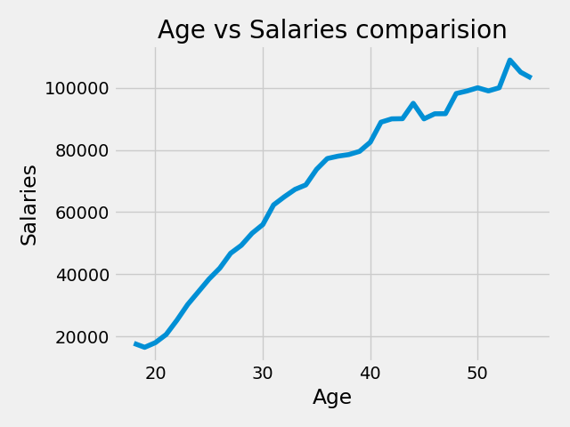
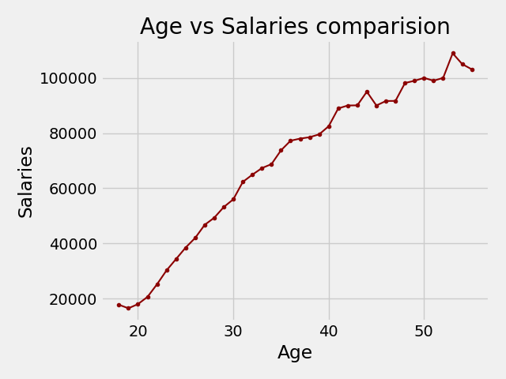
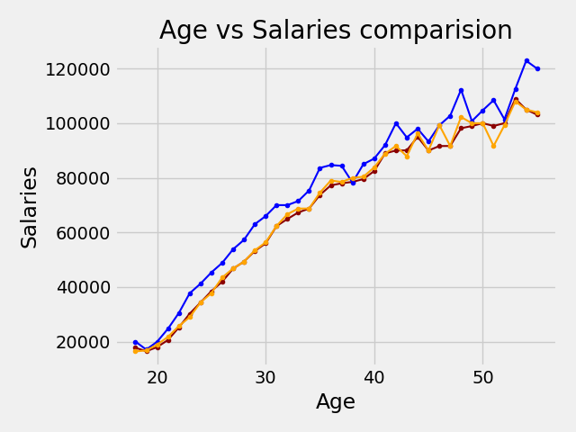
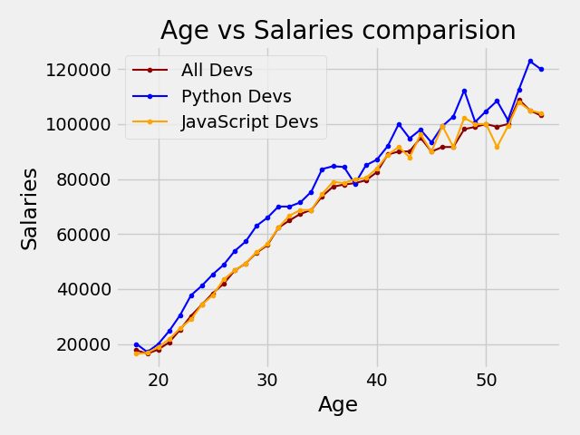

## Matplotlib and Its Key Applications

Matplotlib is a popular Python library used for creating various types of visualizations, including line plots, scatter plots, bar charts, histograms, and more. It is widely utilized because it provides a simple and effective way to visualize data, making it easier to understand patterns, trends, and insights. In this guide, we will explore the basics of Matplotlib and keep the explanations straightforward.

## Installation

To get started with Matplotlib, we need to install it. You can do this by running the following command in your terminal. While updating pip before installing Matplotlib is optional, it is recommended for best practices.


```
python -m pip install --upgrade pip
```
```
# For Linux and Mac
python3 -m pip install matplotlib
```
```
# For Windows
python -m pip install matplotlib
```

## Creating our first chart.

To use Matplotlib, we need to import it into our code editor, such as Visual Studio Code, Sublime Text, Atom, or Jupyter Notebook.


```
# Importing matplotlib
From matplotlib import pyplot as plt
```
```
#  Or we can also write 
import matplotlib.pyplot as plt
```
## 
To create a plot, we need some data. Here is some sample data that we can use:

```
x_axis = [18, 19, 20, 21, 22, 23, 24, 25, 26, 27, 28, 29, 30, 31, 32, 33, 34, 35,
          36, 37, 38, 39, 40, 41, 42, 43, 44, 45, 46, 47, 48, 49, 50, 51, 52, 53, 54, 55]


y_axis = [17784, 16500, 18012, 20628, 25206, 30252, 34368, 38496, 42000, 46752, 49320, 53200, 56000, 62316, 64928, 67317, 68748, 73752, 77232,
         78000, 78508, 79536, 82488, 88935, 90000, 90056, 95000, 90000, 91633, 91660, 98150, 98964, 100000, 98988, 100000, 108923, 105000, 103117]


py_dev_y = [20046, 17100, 20000, 24744, 30500, 37732, 41247, 45372, 48876, 53850, 57287, 63016, 65998, 70003, 70000, 71496, 75370, 83640, 84666,
            84392, 78254, 85000, 87038, 91991, 100000, 94796, 97962, 93302, 99240, 102736, 112285, 100771, 104708, 108423, 101407, 112542, 122870, 120000]


js_dev_y = [16446, 16791, 18942, 21780, 25704, 29000, 34372, 37810, 43515, 46823, 49293, 53437, 56373, 62375, 66674, 68745, 68746, 74583, 79000,
            78508, 79996, 80403, 83820, 88833, 91660, 87892, 96243, 90000, 99313, 91660, 102264, 100000, 100000, 91660, 99240, 108000, 105000, 104000]
```
To plot the data, we can use the following code:
```
plt.plot(x_axis, y_axis)
plt.show()
```
See how easy it is to get started with Matplotlib? Here's what our first chart might look like:

However, the initial chart isn't very refined. Let's make some modifications to improve its appearance.
```
#Title of the chart
plt.title("Age Vs. Salaries comparision")
```
```
# Lablel for x & y-axis
plt.xlabel("Age")
plt.ylabel("Salaries")
```
After these simple modifications, our chart becomes more readable:

Isn't this much clearer? Now, let's look at some additional functionalities.
```
plt.plot(x_axis, y_axis, color="darkred", linewidth=1.5, marker=".", label="All Deves")
```

__color__: It sets the color of the line in the plot

__linewidth__: Controls the thickness of the line

__marker__: Visual indicators for highlighting the line.


```
# Here are some of the marker attribute options:

'.' : Point marker (a small dot)
',' : Pixel marker (even smaller dot)
'o' : Circle marker
'v' : Triangle down marker
'^' : Triangle up marker
's' : Square marker
'D' : Diamond marker
'*' : Star marker
'+' : Plus marker
```
For more color options, check out the [Matplotlib color palettes](https://matplotlib.org/stable/gallery/color/named_colors.html#css-colors,).

So after that modification our plot looks somthing like this.


Let's add more data to it. 
```
plt.plot(x_axis, py_dev_y, color="blue", linewidth=1.5, marker=".", label="Python Devs")
```
```
plt.plot(x_axis, js_dev_y, color="orange", linewidth=1.5, marker=".", label="JavaScript Devs")
```
There's no need to write `plt.show()` repeatedly as long as it's called after all `plt.plot()` calls.
```
# All developers
plt.plot(x_axis, y_axis, color="darkred", linewidth=1.5, marker=".", label="All Deves")

# Python developers
plt.plot(x_axis, py_dev_y, color="blue", linewidth=1.5, marker=".", label="Python Devs")

# JavaScript developers
plt.plot(x_axis, js_dev_y, color="orange", linewidth=1.5, marker=".", label="JavaScript Devs")
plt.show()
```


This looks great! But it's hard to distinguish between the different lines, so let's use the `legend` method:
```
# Since we have already labeled the plots, we can simply call
plt.legend()
```


That wraps up the basics section. Finally, you can save your plot using the following command: `plot.savefig("your_plot_name.extension")`.

Goood Luck, See you next time.